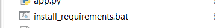
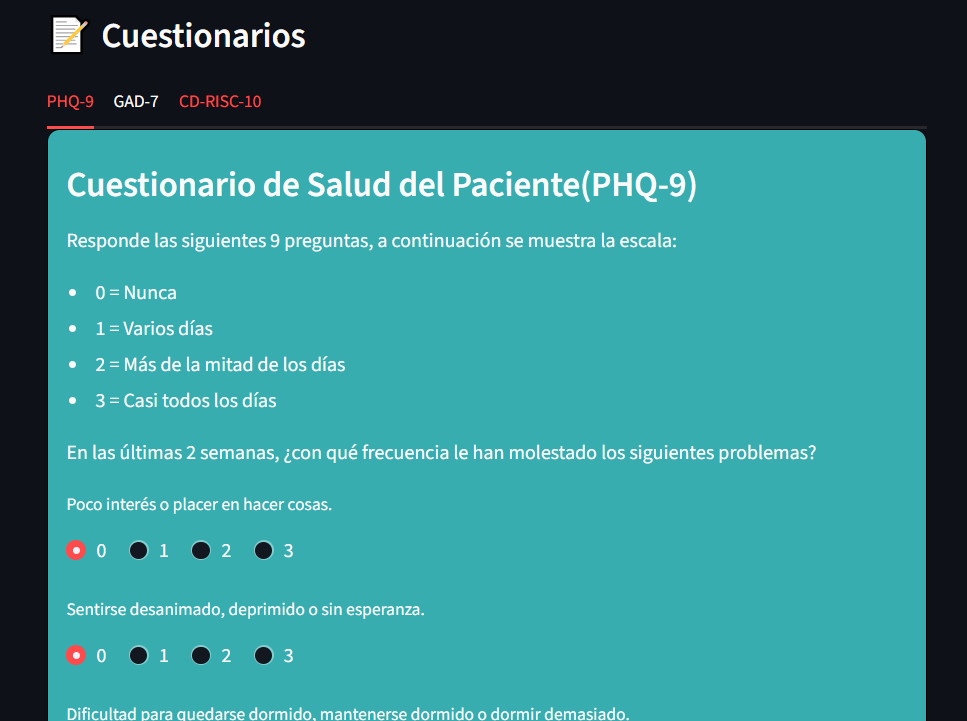
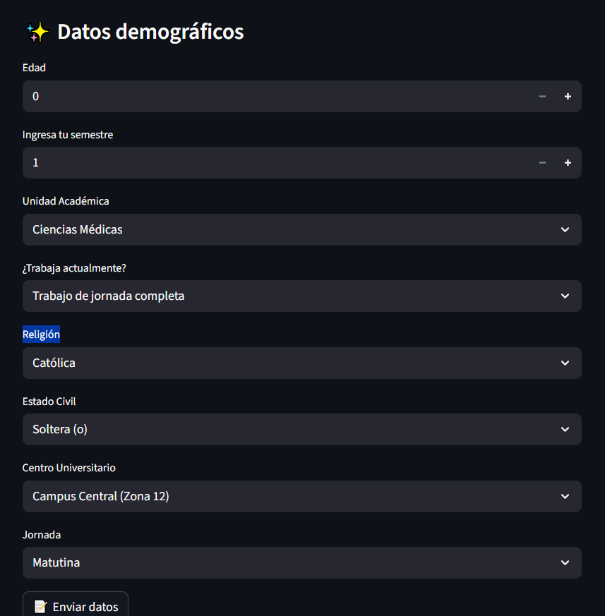

# Test de Bienestar Mental - Proyecto de Machine Learning

---

A partir de un conjunto de datos de 7819 registros se implementaron distintos modelos de machine learning para la predición y clasificación del Bienestar Mental (El MHC-SF es una escala que mide el bienestar emocional) que puede agrupar 3 categorías.

El objetivo de este proyecto es **predecir el estado de bienestar mental** (`mhc_dx`) de los individuos a partir de una combinación de escalas psicológicas y variables demográficas.  

* **0 = Languishing / Desanimado**
→ Bajo nivel de bienestar emocional, psicológico y social. La persona se siente apagada, vacía, desconectada. No necesariamente tiene un trastorno clínico, pero tampoco florece.

* **1 = Moderado**
→ Bienestar intermedio. No se cumplen criterios de florecimiento, pero tampoco de languidecer. Es un punto medio.

* **2 = Flourishing / Florecido**
→ Alto bienestar positivo. La persona experimenta emociones positivas frecuentes, propósito vital, relaciones satisfactorias, funcionamiento social adecuado y resiliencia.

También se documentó el proceso de limpieza y transformación de datos del conjunto original para un mejor detalle del flujo completo de la implementación para el machine learning.

---
# Secciones 

## **/data**

Esta carpeta contiene los datasets, desde los datos originales y como fueron cambiando en la limpieza y trasnformación, además del libro de codigos para ver los valores de las variables de entrada.

## **/notebooks**

Esta carpeta contiene los cuadernos trabajados en Jupyter Notebook con el lenguaje Python. Cada uno está numerado en el orden que se trabajó y muestra la exploración, limpieza, transformación y validación de los datos.

## **/models**

Esta carpeta contiene los modelos creados y entrenados que pueden importarse y usarse con entradas nuevas.

## **/src**

Carpeta de codigos, aquí están en orden por subcarpetas el código en python que se fue trabajando en conjunto de la librería Sklearn.

Cada algoritmo tiene documentación que explica el propósito del mismo, sus resultados y conclusiones obtenidas.

## **app.rar**

Es una carpeta comprimida para el uso local de la aplicación, contiene los modelos y scripts necesarios para su funcionamiento.

## **LICENSE**

La Apache License 2.0 es una licencia de software permisiva, lo que significa que permite a otros usar, modificar y distribuir el código con muy pocas restricciones.

En términos simples:

- Puedes usar el código para proyectos personales o comerciales.

- Otros pueden modificarlo y crear derivados de tu trabajo.

- Pueden redistribuirlo, incluso como parte de software propietario, siempre que incluyan un aviso de copyright y la licencia.

La licencia protege al autor de responsabilidades legales y garantiza que el software se proporciona “tal cual” (sin garantías).

---

# Manual de uso de aplicación en máquina local

La siguiente sección describe el flujo de uso de la aplicación local.

## **Paso 1**

Descomprimir el archivo **app.rar** en una carpeta.

## **Paso 2**

Se debe tener instalado python versión 3 y pip. Puede hacerlo desde Microsoft Store si no está familiarizado o si tiene conocimiento usar la página oficial **python.org**.

Si ya tiene instalado estos requerimientos puede omitir este paso.

## **Paso 3**

Si es la primera vez que usará la aplicación debe instalar las dependencias necesarias, para ello ejecute como administrador el siguiente archivo **.bat**:

Esto despliega una ventana de comandos que instalará las dependencias necesarias. Solo es necesario la primera vez.

## **Paso 4**

**Iniciar proyecto**, para ello debe ejecutar como administrador el siguiente archivo:

Esto nuevamente despliega una ventana de comandos que permanecerá abierta mientras la app esté en uso.

Se abrirá una ventana de su navegador donde podrá interactuar con la aplicación.

## **NOTAS ADICIONALES:**

 - Los archivos **.bat** es un archivo por lotes con una lista de comandos para que el usuario no tenga que configurar mayor cosa, por ser comandos de instalación o ejecución el antivirus puede marcar advertencia y poner en cuarentena el archivo, configure si esto pasa para permitir la ejecución.

 - No pasa nada si vuelve a ejecutar **install_requirements.bat** otra vez, si ya está instalado todo no se va a volver a instalar, si no está seguro puede volver a repetir la ejecución del archivo sin problema.

 - La primera vez que se ejecute **star_app.bat** puede que en la ventana de símbolo del sistema (cmd) aparezca una solicitud de ingresar correo. Esto es por la librería **Streamlit** que es donde se ejecuta y puede dar **Enter** dejando en blanco el espacio. Luego de eso volver a ejecutar el archivo para iniciar la aplicación.  

## **Paso 5**

En la primera sección se tendrán 3 cuestionarios que debe responder, se indican instrucciones.

Puede cambiar entre cuestionarios dando un clic a la **pestaña** deseada. Las respuestas quedarán guardadas sin importar cuantas veces cambie entre pestañas.

## **Paso 6**

En la segunda sección se le pedirán otros datos, esta vez algunos serán de respuesta directa parametrizada o bien con respuestas predefinidas en listas seleccionables.

De clic en **Enviar datos** para ver resultados.

## **Paso 7**

A continuación los resultados que ofrece la aplicación.

### Gaussian NB:

Es un algoritmo de clasificación que asume que los datos de cada categoría siguen una distribución normal (campana). Mira los valores de las características y calcula la probabilidad de que un dato pertenezca a cada clase, eligiendo la más probable. Es rápido y sencillo, ideal cuando los datos se ajustan a esta suposición.

### K-Nearest Neighbors:

Este algoritmo clasifica un dato nuevo viendo quiénes son sus “vecinos más cercanos” en los datos que ya conoce. Básicamente, mira los puntos más cercanos y asigna la categoría que más se repite entre ellos. Es intuitivo y fácil de entender, pero puede ser más lento si hay muchos datos.

### MLP Classifier:

Es un algoritmo de red neuronal que aprende patrones complejos en los datos. Toma varias entradas, las procesa a través de capas de “neuronas” artificiales y predice la clase más probable. Es útil cuando los datos no son lineales y hay relaciones complejas entre las variables.

### KMeans:

Es un algoritmo de agrupamiento (clustering) que no necesita etiquetas. Agrupa los datos en “clusters” según su similitud: los puntos cercanos terminan en el mismo grupo. No predice una categoría exacta como los clasificadores, sino que identifica grupos naturales dentro de los datos.

## **Paso 8**

Para cerra la aplicación debe darle en **Cerrar Aplicación** y la ventana de comandos se cerrará automáticamente; solamente cierre manualmente la pestaña del navegador.

**NOTA**: No tocar otra opción o configuración como **deploy** o los puntos del menú lateral.

----

Copyright 2025 Moises David Maldonado de León
Licensed under the Apache License, Version 2.0
http://www.apache.org/licenses/LICENSE-2.0
