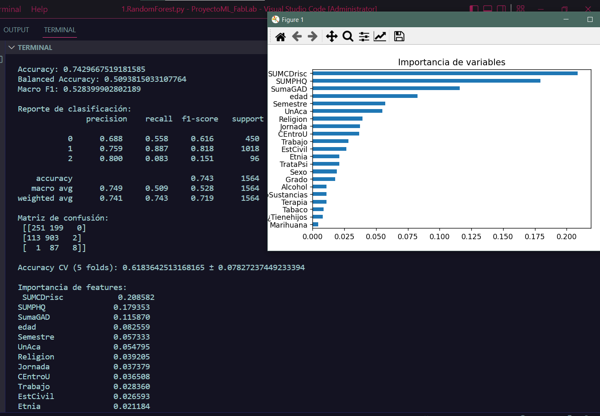

# Random Forest

El algoritmo "Random Forest" permite evaluar múltiples árboles de decisión basado en los features/variables hacie una variable objetivo/target (Y).

Esta forma paralela de evaluar multiples árboles tomando de manera aleatoria cada feature permite obtener una base suficientemente sólida para poder identificar **las variables de mayor impacto** en los datos. De este modo pueden identificar cuales no aportan información para el entrenamiento y cuales sí.

# Análisis de Resultados


¡Muy buen resultado para ser un primer modelo! Aquí un resumen rápido para interpretar lo que ves:

---

### Métricas principales

* **Accuracy \~74.3%:** El porcentaje total de aciertos está bien, pero en clases desbalanceadas puede ser engañoso.
* **Balanced Accuracy \~51%:** Corrige el desbalance de clases; indica que el modelo no está tan bueno en todas las clases.
* **Macro F1 \~53%:** Promedio de F1 por clase, muestra que en general el desempeño es moderado, con clases más difíciles.

---

### Por clase

* Clase **0 (Desanimado)**: precisión decente (0.69), pero recall bajo (0.56), muchas predicciones faltaron (falsos negativos).
* Clase **1 (Moderado)**: excelente recall (0.89) y buena precisión (0.76), se predice muy bien.
* Clase **2 (Florecido)**: precisión alta (0.80) pero recall bajísimo (0.08), casi no detecta a los florecidos correctamente (falsos negativos muy altos).

---

### Matriz de confusión

* Muchos florecidos clasificados erróneamente como moderados (87 casos).
* Modelo tiende a confundir clases menos frecuentes con la clase mayoritaria/moderada.

---

### Importancia de features

* Variables clave:

  * `SUMCDrisc`, `SUMPHQ`, `SumaGAD` (tests o escalas psicológicas), que tienen mucho peso — tiene sentido, pues son indicadores directos.
  * `edad` también influye bastante.
* Variables demográficas y consumo tienen menor relevancia (pero no descartes que puedan aportar).

---

### En resumen

* El modelo funciona bien para la clase **moderado** (la mayoría), pero le cuesta distinguir bien las clases minoritarias, sobre todo "Florecido".


---
## Valoración de variables candidatas

Se tomarán las primeras 11 características:
|Nombre|Valor|
|--|--|
 |SUMCDrisc    |        0.208582|
 |SUMPHQ       |        0.179353|
 |SumaGAD       |       0.115870|
 |edad           |      0.082559|
 |Semestre        |     0.057333|
 |UnAca            |    0.054795|
 |Religion          |   0.039205|
|Jornada            |  0.037379|
 |CEntroU             | 0.036508|
| Trabajo              |0.028360|
| EstCivil             |0.026593|

Se agrega el uso del class_weight: esto permite mejorar ligeramente el recall de la clase minoritaria (aunque sigue bajo), y en la validación cruzada el promedio sube (0.56 → 0.60). Esto significa que está ayudando a que el modelo sea un poco más sensible a las clases pequeñas.

---

### **`f1_score`**

* El **F1-score** es una métrica que combina **precisión (precision)** y **recall** en un solo número.
* **Precisión (Precision)**: De todos los casos que el modelo predijo como positivos, ¿cuántos eran realmente positivos?
* **Recall (Sensibilidad)**: De todos los casos realmente positivos, ¿cuántos logró identificar el modelo?

El F1-score se calcula como la **media armónica** de precisión y recall:

$$
F1 = 2 \cdot \frac{Precision \cdot Recall}{Precision + Recall}
$$

* Valor entre **0 y 1**, donde 1 es perfecto.

---

### **`average='macro'`**

* En problemas de **multiclase** (como `mhc_dx` con 3 clases: Languishing, Moderado, Flourishing), el F1 se calcula **por clase**.
* **`macro`** significa que:

  1. Calcula el F1 para cada clase por separado.
  2. Hace un **promedio simple** (sin ponderar por la cantidad de ejemplos por clase).
* Esto es útil cuando se quiere **tratar todas las clases por igual**, aunque algunas tengan menos muestras.

```python
print("Macro F1:", f1_score(y_test, y_pred, average='macro'))
```

* Dice **qué tan bien, en promedio, el modelo clasifica cada clase**, sin que las clases grandes dominen el resultado.
* Si tienes clases desbalanceadas (por ejemplo, muchas Moderado y pocas Flourishing), el **macro F1** te da una visión más justa que el accuracy simple.

---

### **`macro`**

* Calcula **F1 por clase** y luego hace un **promedio simple**.
* Cada clase cuenta **igual**, sin importar cuántos ejemplos tenga.
* Útil si se quiere que **todas las clases tengan el mismo peso**.

### **`micro`**

* Calcula **total de verdaderos positivos, falsos positivos y falsos negativos** entre todas las clases, y luego el F1.
* Da más peso a las **clases con más ejemplos**.
* Útil si importa la **exactitud global** más que la equidad entre clases.

### **`weighted`**

* Calcula **F1 por clase** y hace un **promedio ponderado por cantidad de ejemplos en cada clase**.
* Mezcla lo mejor de macro y micro: tiene en cuenta el tamaño de cada clase.
* Útil cuando se quiere un **promedio justo considerando el desbalance** de clases.


---

## Mejoras implementadas

Se le agrega al modelo la variación de class_weigth a **balanced**; esto con la finalidad de que el modelo no ignore las clases minoritarias.

```
if use_random_forest:
    model = RandomForestClassifier(
        n_estimators=100,
        max_depth=None,
        class_weight='balanced', # Evita que el modelo “ignore” clases minoritarias.
        random_state=42,
        n_jobs=-1
    )
```

Los resultados:

```
Accuracy: 0.7269820971867008
Balanced Accuracy: 0.49168958742632607
Macro F1: 0.511349276160297
```

Reporte de clasificación:
```
               precision    recall  f1-score   support

           0      0.663     0.507     0.574       450
           1      0.745     0.885     0.809      1018
           2      0.800     0.083     0.151        96

    accuracy                          0.727      1564
   macro avg      0.736     0.492     0.511      1564
weighted avg      0.724     0.727     0.701      1564


Matriz de confusión:
 [[228 222   0]
 [115 901   2]
 [  1  87   8]]

Accuracy CV (5 folds): 0.634476783286126 ± 0.05751417223022848

Importancia de features:
 SUMCDrisc            0.242555
SUMPHQ               0.176616
SumaGAD              0.122259
edad                 0.083096
Semestre             0.051330
UnAca                0.050963
Religion             0.034397
CEntroU              0.034147
Jornada              0.033133
Trabajo              0.026308
EstCivil             0.023699
Etnia                0.019955
Sexo                 0.018965
TrataPsi             0.017975
Grado                0.015464
ConsumoSustancias    0.010241
Alcohol              0.009837
¿Tienehijos          0.009619
Terapia              0.009198
Tabaco               0.007029
Marihuana            0.003214
dtype: float64
```

Se observa que algunos valores disminuyeron, esto porque el **balanced** intenta ajustar mejor la clasificación, sin embargo el rendimiento no mejora significativamente y las features más importantes se siguen manteniendo al modelo original.

Para temas de exploración de datos se deja el modelo original.