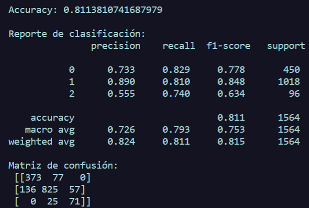

# Propósito general
Este script entrena un clasificador Gaussian Naive Bayes para predecir el estado de bienestar categórico (mhc_dx) a partir de escalas psicológicas y variables demográficas/contextuales. Se realiza preprocesamiento (división, escalado), entrenamiento, predicción y evaluación con métricas estándar.


## Librerías
Modelo probabilístico que asume features independientes y distribuciones gaussianas:
>from sklearn.naive_bayes import GaussianNB 

Métricas de evaluación:
* **acuracy_score:** Calcula la proporción de etiquetas predichas correctamente.

* **classification_report:** Proporciona un informe de texto que muestra las principales métricas de clasificación para cada clase.

* **confusion_matrix:** Genera una matriz que resume el rendimiento de un modelo de clasificación, mostrando verdaderos positivos, verdaderos negativos, falsos positivos y falsos negativos.

>from sklearn.metrics import accuracy_score, classification_report, confusion_matrix

Para dividir datos en entrenamiento y prueba (80% de entrenamiento y 20% de prueba):
>from sklearn.model_selection import train_test_split

Escalado para normalizar las features
>from sklearn.preprocessing import StandardScaler  

---

Sin estratificación, una división aleatoria podría resultar en que uno de los subconjuntos (de entrenamiento o de prueba) tenga una representación desproporcionadamente baja o alta de una clase específica, especialmente en conjuntos de datos desequilibrados. 

Esto puede llevar a:
* Evaluación de modelos sesgados:
    *  Es posible que el rendimiento del modelo en el conjunto de pruebas no refleje con precisión su rendimiento en el mundo real.
* Entrenamiento de modelos deficiente:
    * Si el conjunto de entrenamiento carece de suficientes ejemplos de una clase minoritaria, el modelo puede tener dificultades para aprender patrones relacionados con esa clase, lo que genera una generalización deficiente.

Al utilizar stratify=y, se garantiza que la distribución de clases en los conjuntos de entrenamiento y de prueba refleje la del conjunto de datos original, lo que promueve una evaluación y un entrenamiento de modelos más sólidos.

La configuración **random_state** garantiza que se genere la misma división de manera consistente en múltiples ejecuciones de su código, lo que es crucial para depurar, comparar el rendimiento del modelo y compartir resultados.

Garantiza que los conjuntos de entrenamiento y prueba contengan los mismos puntos de datos en cada ejecución, lo que permite una evaluación y un análisis confiables del comportamiento del modelo. el 42 es meramente la semilla y es referencia Douglas Adams. 

> X_train, X_test, y_train, y_test = train_test_split(X, y, test_size=0.2, random_state=42, stratify=y)

Normalizar las features para tener media 0 y desviación estándar 1.
**fit_transform** se ajusta en el conjunto de entrenamiento y transforma; luego se aplica la misma transformación al test. Esto evita fuga de información del test al entrenamiento.

>scaler = StandardScaler()
X_train_scaled = scaler.fit_transform(X_train)
X_test_scaled = scaler.transform(X_test)

---
# Análisis de Resultados


## 1️⃣ Precisión global

```
Accuracy: 0.811
```

* Esto significa que **el 81.1% de las predicciones fueron correctas** en el conjunto de prueba.
* Para un modelo inicial, es un buen punto de partida, pero **el accuracy por sí solo no es suficiente** si las clases están desbalanceadas.

---

## 2️⃣ Rendimiento por clase

Del reporte:

| Clase | Precision | Recall | F1-score | Soporte |
| ----- | --------- | ------ | -------- | ------- |
| 0     | 0.733     | 0.829  | 0.778    | 450     |
| 1     | 0.890     | 0.810  | 0.848    | 1018    |
| 2     | 0.555     | 0.740  | 0.634    | 96      |

**Interpretación:**

* **Clase 0** (Languishing): recall alto (0.829) → detecta la mayoría de los casos reales, pero precision algo más baja (0.733) → a veces predice clase 0 cuando no lo es.
* **Clase 1** (Moderado): es la más fuerte → alta precision (0.890) y buen recall (0.810).
  El modelo la identifica muy bien.
* **Clase 2** (Floreciente): problema aquí → precision baja (0.555) pero recall decente (0.740). Esto significa que detecta bien la mayoría de casos reales de clase 2, pero **mete demasiados falsos positivos** (predice floreciente cuando no lo es).

---

## 3️⃣ Macro vs. Weighted average

* **Macro avg (0.753 F1)**: promedio simple por clase, muestra que las tres clases no tienen rendimiento igual.
* **Weighted avg (0.815 F1)**: ponderado por soporte, favorece la clase 1 porque tiene más casos.

---

## 4️⃣ Matriz de confusión

```
[[373  77   0]  
 → Clase real 0: 373 correctos, 77 mal clasificados como 1, 0 como 2

[136 825  57]   
 → Clase real 1: 825 correctos, 136 mal clasificados como 0, 57 como 2

[  0  25  71]]  
 → Clase real 2: 71 correctos, 25 mal clasificados como 1
```

**Observaciones**:

* **Clase 2 nunca se confunde con clase 0** (eso es bueno, indica que esas clases están bien separadas).
* **Clase 2 se confunde mucho con clase 1** (25 casos → quizás las variables no discriminan bien entre moderado y floreciente).
* Clase 1 también envía 57 casos hacia clase 2 (falsos positivos para clase 2).

---

## 5️⃣ Posibles causas

* GaussianNB asume que cada feature sigue una **distribución normal** dentro de cada clase. Si no se cumple, puede afectar precisión.
* Si hay correlación fuerte entre features, Naive Bayes puede perder rendimiento (porque asume independencia).
* Clase 2 tiene **pocos ejemplos (96)**, lo que limita su capacidad de aprender patrones claros → explica su precision baja.
* Las variables sociales/demográficas pueden tener menos poder predictivo para separar moderado de floreciente.

---
# Conclusiones
Este modelo podría emplearse como herramienta de clasificación temprana del bienestar psicológico, por ejemplo:

* **En investigación:** para segmentar automáticamente a participantes en estudios de salud mental, asignándolos a categorías de bienestar (languishing, moderado, floreciente) y facilitar análisis posteriores.

* **En entornos clínicos o educativos:** como filtro inicial para detectar perfiles que requieren atención o seguimiento, reduciendo la carga en evaluaciones manuales.

* **En programas de intervención:** para orientar recursos hacia grupos que muestren mayor riesgo (clase 0) o para evaluar el impacto de intervenciones midiendo cambios en las predicciones del modelo a lo largo del tiempo.

Con los resultados que se tiene, es válido concluir que este modelo es especialmente útil como punto de partida para predecir y clasificar la clase 1 (moderado).

Justificación:

* Tiene alta precisión (0.890) → pocas predicciones de clase 1 son erróneas.

* Tiene buen recall (0.810) → detecta la mayoría de los casos reales de clase 1.

* Su F1-score (0.848) indica un balance sólido entre precisión y recall.

Puede actuar como filtro rápido para segmentar automáticamente la mayoría de los casos en clase 1, y dejar las otras clases para una evaluación más detallada.