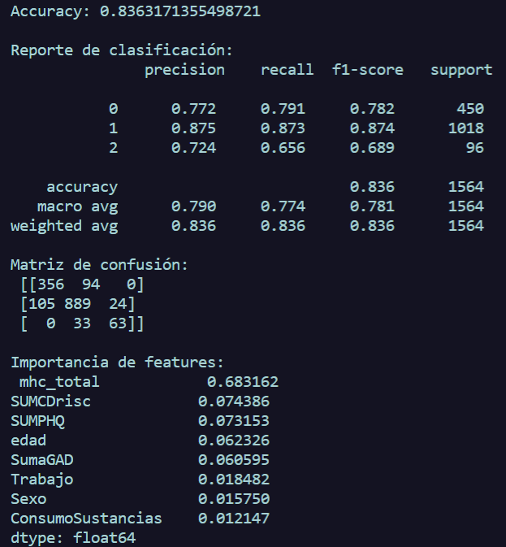

# Propósito general
Este script entrena un árbol de decisión para clasificar el bienestar categórico (mhc_dx: 0=languishing, 1=moderado, 2=floreciente) a partir de escalas psicológicas y variables demográficas/contextuales. A diferencia de GaussianNB, el árbol puede capturar interacciones no lineales y no asume independencia entre features, lo que lo hace útil como modelo interpretable “base” o para detectar umbrales críticos en las variables.

## Limitaciones / riesgos
**Sobreajuste:** por defecto puede memorizar el ruido del entrenamiento si no se regula (profundidad ilimitada, hojas pequeñas).

**Inestabilidad:** pequeños cambios en los datos pueden alterar la estructura del árbol.

**Sesgo hacia features** con más niveles si no se controla (aunque con tus codificaciones numéricas esto es menor).

---
# Análisis de Resultados


Está rindiendo **mejor que GaussianNB** en accuracy y en varias métricas clave.

### Comparación general contra GaussianNB básico (\~0.811)

* **Accuracy:** sube de \~0.811 a **0.836** (+2.5 puntos), lo que es una mejora real, no solo ruido estadístico.

* **Clase 0 (languishing)**:

  * Recall baja un poco (0.829 → 0.791), pero precisión se mantiene alta y balanceada.
* **Clase 1 (moderado)**:

  * Muy buena estabilidad, recall y precisión cerca de 0.87.
* **Clase 2 (floreciente)**:

  * Baja en recall comparado con Naive Bayes (0.740 → 0.656), aunque mejora bastante en precisión (0.555 → 0.724).
  * Esto significa que el árbol es más estricto en asignar clase 2: acierta más cuando lo hace, pero detecta menos casos reales.

---

### Interpretación de importancia de variables

```
mhc_total            0.683  → dominante en el modelo, casi 70% de la decisión.

SUMCDrisc            0.074
SUMPHQ               0.073
edad                 0.062
SumaGAD              0.061
Trabajo              0.018
Sexo                 0.016
ConsumoSustancias    0.012
```

* **`mhc_total`** es la variable estrella: es la primera rama principal del árbol y explica la mayor parte de la separación.
* Las otras escalas (`SUMCDrisc`, `SUMPHQ`, `SumaGAD`) aportan \~20% en conjunto.
* Variables demográficas (edad, trabajo, sexo, consumo) tienen peso muy bajo, lo que indica que su influencia es marginal para este modelo.
* Esto confirma que **el bienestar categórico está muy asociado a la escala `mhc_total`** y en menor grado a otras escalas clínicas, mientras que los datos demográficos no agregan mucho valor predictivo.

---

### Conclusiones prácticas

* **Decision Tree gana en accuracy y precisión en clase 2** comparado con GaussianNB, aunque sacrifica algo de recall en esa clase.

* Si se busca **máxima detección de clase 2**, GaussianNB tiene mejor recall, pero si buscas **predicciones más confiables cuando dice que es clase 2**, el árbol es mejor.

## Diferencias observadas
**GaussianNB**
Da probabilidades suaves por clase; por ejemplo, caso 3 tiene ~0.86 para clase 1 y ~0.14 para clase 2 — te dice “está bastante en la frontera”.

Predice: [1 0 1 1 2 1 2 1 2 1] — mezcla de clases con matices de confianza.

Es más flexible para casos ambiguos porque refleja incertidumbre.

**Decision Tree**
Da predicciones duras (probabilidades casi one-hot), sin mostrar matices: [0 0 1 1 2 1 2 2 2 2].

En algunos ejemplos (ej. índice 7) el árbol elige clase 2 con 100% aunque GaussianNB daba clase 1 con alta probabilidad — muestra que el árbol está aplicando reglas rígidas.

Tiende a separar claramente regiones del espacio, lo que puede ser bueno para confianza alta pero malo si estás en la frontera.

## Conclusiones
**Confianza vs. suavidad:** GaussianNB es útil para detectar casos dudosos (probabilidades repartidas) y hacer umbralización o revisiones. El árbol da decisiones claras y, cuando ambas coinciden, puedes confiar más.

**Clase 2 (floreciente):** en el histórico el árbol tenía mayor precisión en clase 2 (menos falsos positivos) pero menor recall; aquí se ve que lo asigna de forma binaria — se podría perder algunos verdaderos florecientes que GaussianNB detectaría con menor confianza.

**Resolución de conflictos:** donde difieren (por ejemplo, caso 7: GaussianNB sugiere clase 2 con mezcla, el árbol fuerza 2; caso 0: GaussianNB dice 1 con alta confianza, árbol dice 0), puedes establecer una regla para decidir.